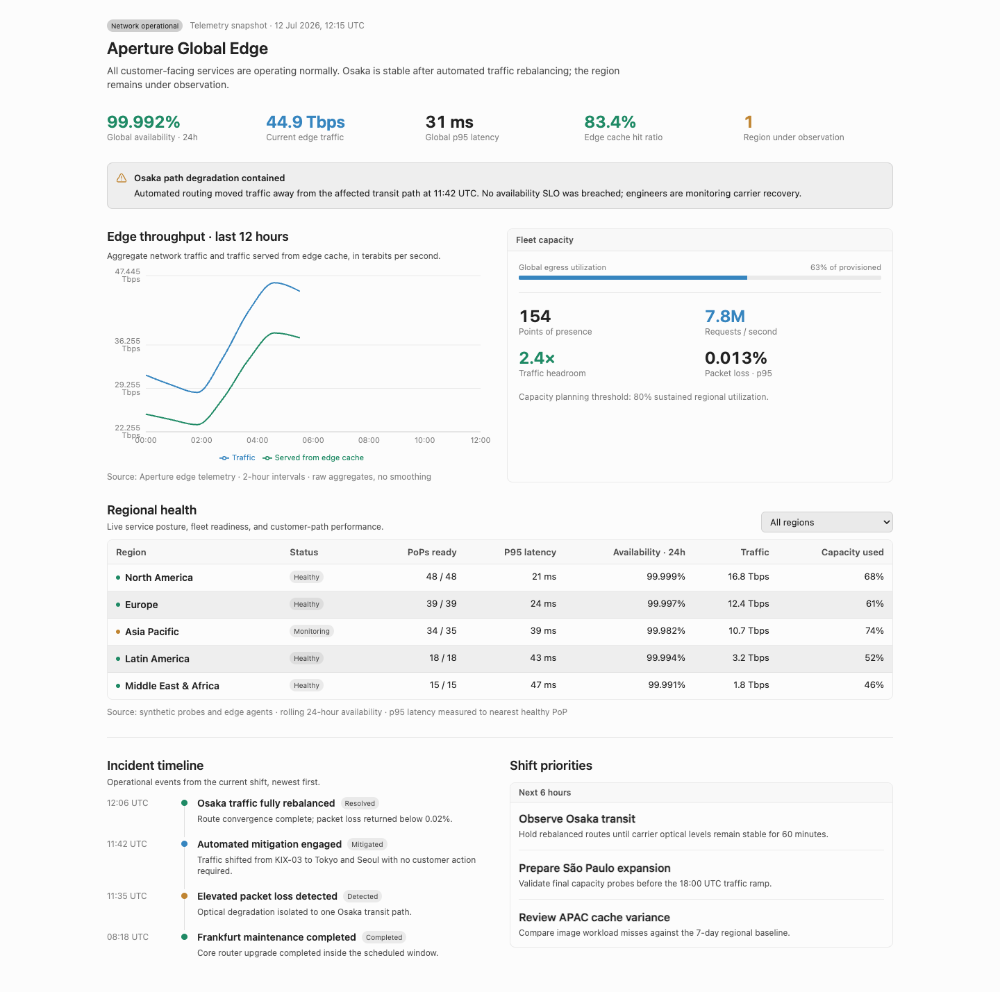

# CanvasX

CanvasX is an independent reimplementation of Cursor's `/canvas` Skill. It keeps the component API and authoring workflow while removing the Cursor dependency, so an agent can generate a standalone HTML canvas that opens directly in a browser.

CanvasX is not affiliated with or endorsed by Cursor or Anysphere.

## Install

Install the `canvasx` Skill from GitHub with the [Skills CLI](https://skills.sh/):

```bash
npx skills add https://github.com/eightHundreds/canvasx --skill canvasx
```

Or install it from a local clone:

```bash
npx skills add . --skill canvasx
```

Then ask your agent to use `$canvasx`.

The Skill includes the compiled `canvasx.umd.js`; users do not install npm packages or run a build. Generated HTML files embed CanvasX and load pinned React, Recharts, Dagre, Lucide React, and Babel runtimes from CDN.

## Example

[Open the generated HTML](examples/canvasx-showcase.html)


